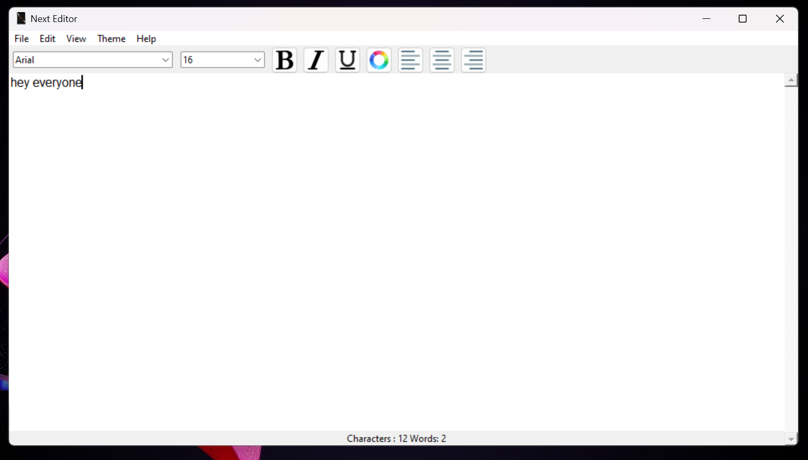
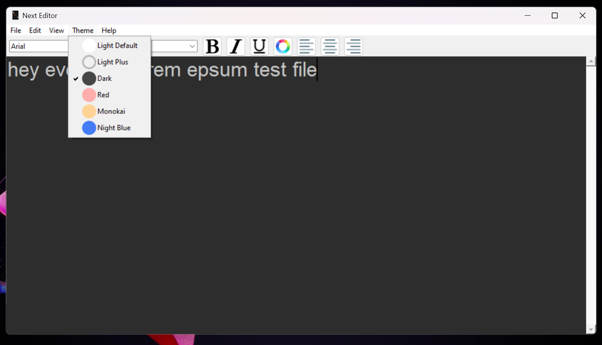
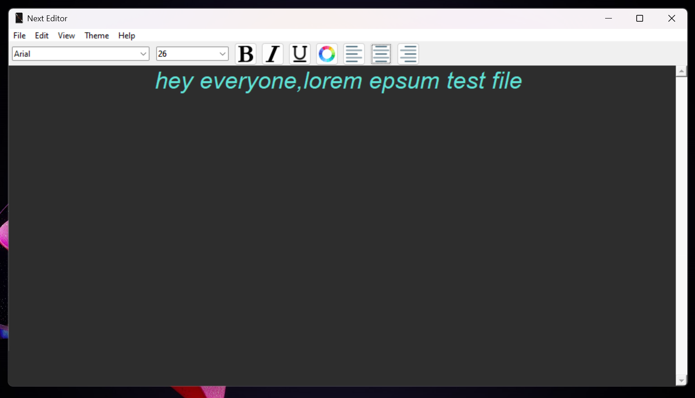
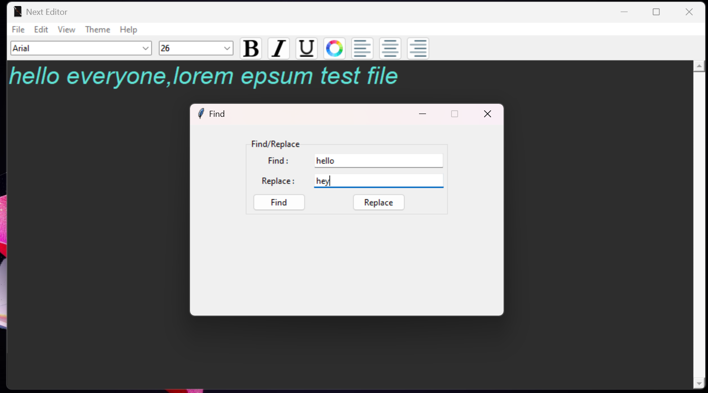

# Next_Editor

Here are few screenshots of the application:

Initial screen:

Different types of themes, fonts and font sizes:

Align left/center/right:

Find a word/sentence with option to replace it:
